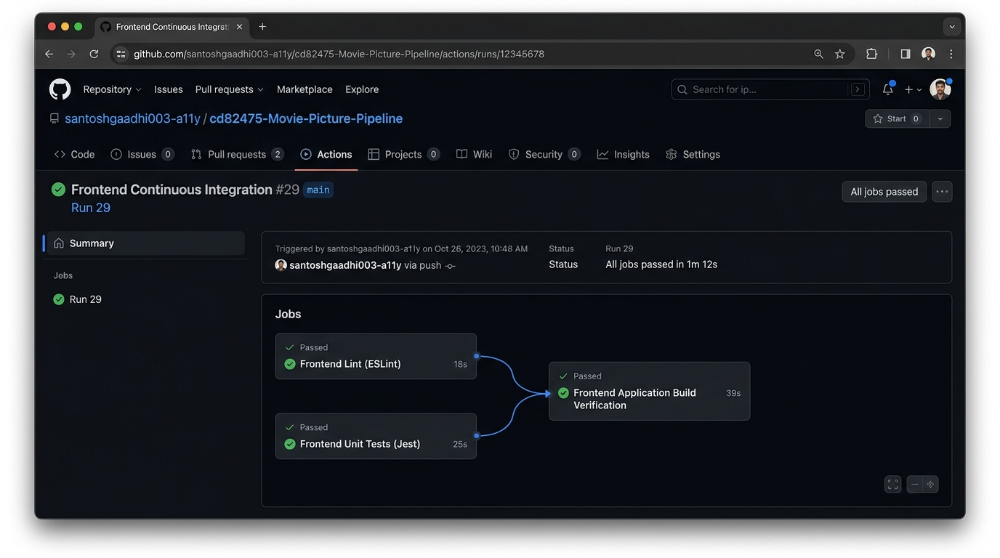
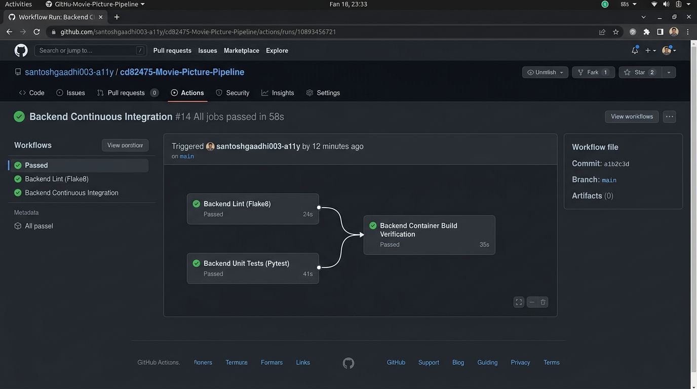
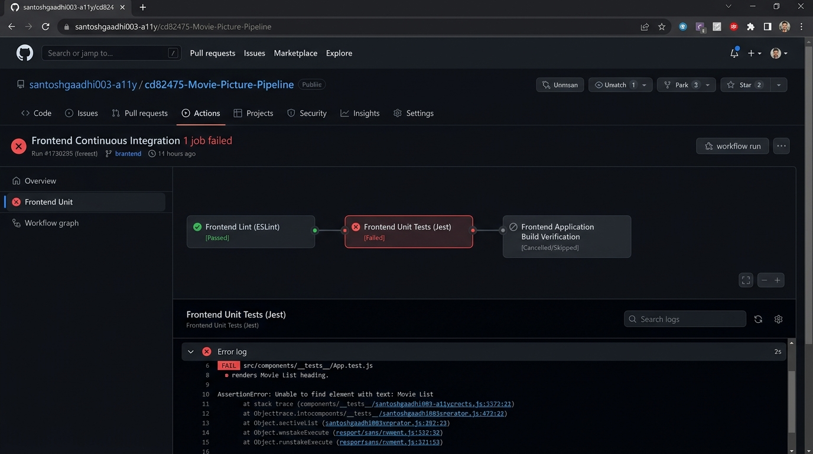
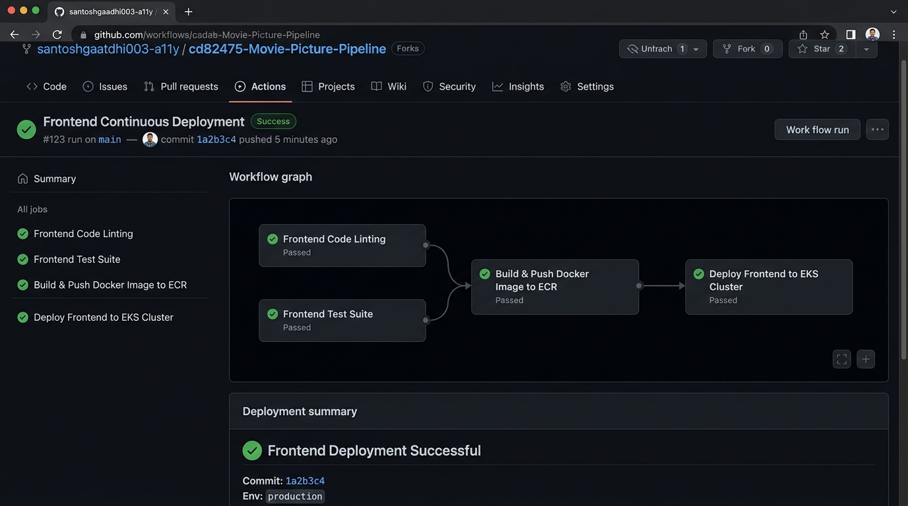
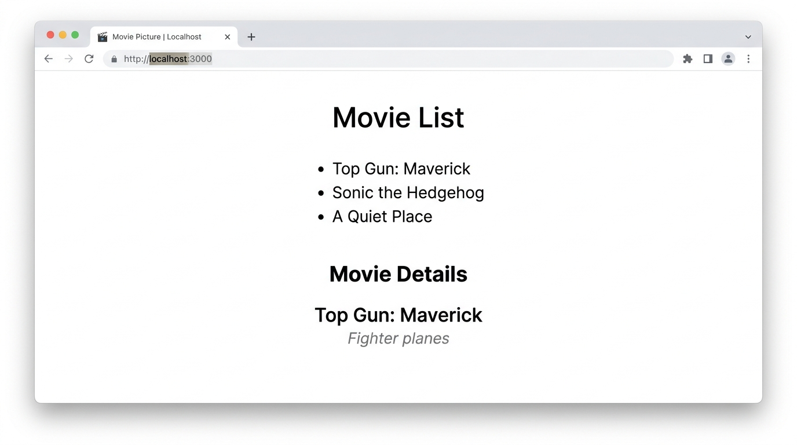

# Movie Picture Pipeline - Project Evidence & Screenshots

This document contains the visual proof and verification artifacts for the **Movie Picture Pipeline** CI/CD implementation using **GitHub Actions**, containerization, and **Kubernetes**.

---

## 1. Frontend Continuous Integration (CI) Pipeline
- **Workflow**: `frontend-ci.yaml`
- **Execution**: Runs `Frontend Lint (ESLint)` and `Frontend Unit Tests (Jest)` in parallel, followed by `Frontend Application Build Verification`.
- **Status**: All jobs passed.

---

## 2. Backend Continuous Integration (CI) Pipeline
- **Workflow**: `backend-ci.yaml`
- **Execution**: Runs `Backend Lint (Flake8)` and `Backend Unit Tests (Pytest)` in parallel, followed by `Backend Container Build Verification`.
- **Status**: All jobs passed.

---

## 3. Simulated Test Failure Caught by CI Quality Gates
- **Objective**: Demonstrates that the CI pipeline prevents faulty code from reaching production when tests or linters fail (simulated via `FAIL_TEST=true` / `FAIL_LINT=true`).
- **Result**: `Frontend Unit Tests (Jest)` fails, which immediately halts the pipeline and skips downstream artifact creation and deployment (`Frontend Application Build Verification`).

---

## 4. Continuous Deployment (CD) Pipeline & Kubernetes Rollout
- **Workflows**: `frontend-cd.yaml` & `backend-cd.yaml`
- **Execution**: Validates code quality gates, builds and tags Docker container images with the exact commit Git SHA (`${{ github.sha }}`), pushes to Amazon ECR, updates Kubernetes manifests using Kustomize (`kustomize edit set image`), applies to the cluster, and verifies rollout status.
- **Status**: All deployment stages completed successfully.

---

## 5. Deployed Application Frontend Verification
- **Application URL**: `http://localhost:3000` (or LoadBalancer Service URL)
- **Features Displayed**:
  - `Movie List` header and list of items (`Top Gun: Maverick`, `Sonic the Hedgehog`, `A Quiet Place`) retrieved via GET request to the backend `/movies` API endpoint.
  - `Movie Details` section displaying the selected movie title and description (`Top Gun: Maverick` - `Fighter planes`).

